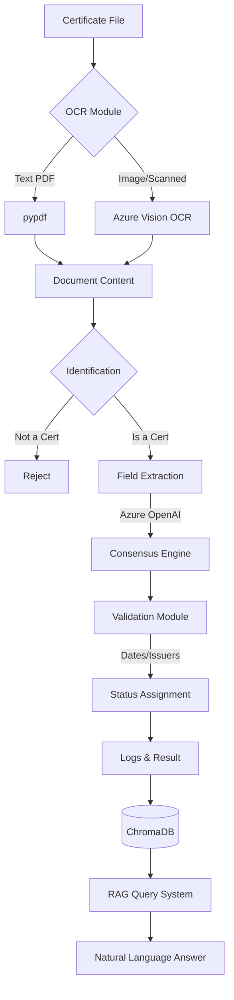

# 📚 Certificate Intelligence & Verification System (CIVS)

[](https://github.com/Flame77X/Certificate-Detection-Extraction-Validation-RAG-Query-System)
[](https://www.python.org/downloads/)
[](LICENSE)
[](https://azure.microsoft.com/en-us/products/ai-services/openai-service)

A production-grade, end-to-end system for **AI-powered certificate detection, field extraction, validation, and RAG-based querying**. This system transforms unstructured certificate documents (PDFs, Images) into structured, verifiable intelligence.

---

## 📖 Table of Contents
1. [🌟 Key Features](#-key-features)
2. [🏗️ System Architecture](#️-system-architecture)
3. [🚀 Quick Start (5 Minutes)](#-quick-start-5-minutes)
4. [🛠️ Installation & Setup](#️-installation--setup)
5. [💻 Usage Guide](#-usage-guide)
    - [Option A: Web API (Flask)](#option-a-web-api-flask)
    - [Option B: Single File (CLI)](#option-b-single-file-cli)
    - [Option C: Batch Processing](#option-c-batch-processing)
6. [🧠 RAG Query System](#-rag-query-system)
7. [🛡️ Security & Compliance](#️-security--compliance)
8. [⚙️ Configuration](#️-configuration)
9. [❓ FAQ & Troubleshooting](#-faq--troubleshooting)

---

## 🌟 Key Features

- **✅ Smart Identification**: Automatically detects if a document is a certificate using multi-layered keyword and context analysis.
- **🧠 5-Field Intelligent Extraction**: Uses Azure OpenAI (GPT-4) with a consensus voting engine to extract:
  - `issuer`, `certificate_number`, `issued_date`, `expiry_date`, `subject`
- **🛡️ Multi-Level Validation**:
  - **Date Logic**: Ensures `issued_date` < `expiry_date` and validates formats.
  - **Issuer Verification**: Cross-references against a `trusted_issuers.json` whitelist.
- **📄 OCR Excellence**: Support for text-based PDFs, scanned PDFs (Azure Vision), and image formats (JPG/PNG).
- **📚 RAG (Retrieval-Augmented Generation)**: Store extracted certificates in a ChromaDB vector database and query them using natural language.
- **📊 Production Ready**: Comprehensive logging (JSONL), security protections (PII redaction, Path traversal), and batch processing capabilities.

---

## 🏗️ System Architecture



---

## 🚀 Quick Start (5 Minutes)

### 1. Install Dependencies
```powershell
pip install -r requirements.txt
```

### 2. Set Up Environment
Copy `.env.example` to `.env` and fill in your Azure keys:
```powershell
cp .env.example .env
```

### 3. Run the Web Interface
```powershell
cd backend
python app.py
```
Visit `http://localhost:5000` to upload and verify certificates!

---

## 🛠️ Installation & Setup

### Prerequisites
- **Python 3.9+**
- **Azure OpenAI API Key** (for extraction & RAG)
- **Azure AI Vision Key** (optional, required only for OCR on images)

### Detailed Steps
1. **Clone the Repository**:
   ```bash
   git clone https://github.com/Flame77X/Certificate-Detection-Extraction-Validation-RAG-Query-System.git
   cd Certificate-Detection-Extraction-Validation-RAG-Query-System
   ```
2. **Environment Configuration**:
   Edit your `.env` file:
   ```env
   AZURE_OPENAI_API_KEY=your_key
   AZURE_OPENAI_ENDPOINT=https://your-resource.openai.azure.com/
   AZURE_OPENAI_DEPLOYMENT_NAME=gpt-4
   AZURE_VISION_KEY=your_vision_key
   AZURE_VISION_ENDPOINT=https://your-region.api.cognitive.microsoft.com/
   ```
3. **Initialize Storage**:
   ```bash
   mkdir -p backend/data/uploads backend/data/logs
   ```

---

## � Usage Guide

### Option A: Web API (Flask)
The primary interface for integration. Starting the server is simple:
```bash
python backend/app.py
```
- **Endpoint**: `POST /upload`
- **Payload**: `multipart/form-data` with key `file`.
- **Response**: Full JSON with fields, confidence, and validation status.

### Option B: Single File (CLI)
Perfect for testing individual files:
```bash
python backend/main.py --file "path/to/my_cert.pdf"
```

### Option C: Batch Processing
Process hundreds of certificates from a CSV list:
```bash
python backend/batch_processor.py --input certificates.csv
```
The results will be saved globally to `batch_results.json`.

---

## 🧠 RAG Query System

The system includes a built-in "Memory" using **ChromaDB**. Once a certificate is processed, its metadata and searchable text are ingested into a vector database.

**What you can ask:**
- *"Who issued the AWS Solution Architect certificate?"*
- *"When does the ISO certificate expire?"*
- *"Are there any certificates from Global Tech Institute?"*

**Implementation:**
- **Vector DB**: ChromaDB (Persistent)
- **Embeddings**: Azure OpenAI `text-embedding-3-small`
- **Query Engine**: GPT-4 (for answering based on retrieved context)

---

## 🛡️ Security & Compliance

Developed with enterprise security in mind:
- **🔒 Path Traversal Protection**: Uses `secure_filename` to prevent malicious file paths.
- **🕵️ PII Redaction**: Sensitive data like emails and phone numbers are masked in logs.
- **📄 Format Lockdown**: Only `pdf`, `jpg`, `png` are accepted.
- **🔑 Secret Management**: API keys are never logged; timeouts prevent resource exhaustion.

---

## ⚙️ Configuration

### Trusted Issuers
Edit `backend/trusted_issuers.json` to manage your whitelist:
```json
{
  "trusted_issuers": [
    "AWS Training",
    "ISO Authority",
    "Microsoft Training"
  ]
}
```

### Limits
Change `MAX_FILE_SIZE_MB = 50` in `backend/app.py` or `.env` to enforce size restrictions.

---

## ❓ FAQ & Troubleshooting

**Q: Why is my document classified as "NOT a certificate"?**
**A**: Ensure your document contains keywords like "Certify", "Diploma", or "Awarded". You can adjust these in `backend/app/certificate_identification.py`.

**Q: Extraction confidence is low.**
**A**: This usually happens with low-quality scans. Enabling Azure Vision OCR in `.env` significantly improves results for images.

**Q: RAG System is "offline".**
**A**: Check your `.env` for `AZURE_EMBEDDING_DEPLOYMENT` and ensure the embeddings model is correctly deployed in your Azure portal.

---

## � Project Structure

```text
├── backend/
│   ├── app.py                # Flask API & Frontend Host
│   ├── main.py               # CLI Entry Point
│   ├── batch_processor.py    # Batch Handling Logic
│   ├── app/                  # Core Logic Modules
│   │   ├── ocr_module.py     # Text & Graphics OCR
│   │   ├── field_extraction.py # AI Extraction Engine
│   │   ├── rag_pipeline.py   # Vector Search & QA
│   │   └── ...               # Security, Validation, Logging
│   └── data/                 # Local Storage (Logs, Uploads, Vector DB)
├── frontend/
│   ├── templates/            # index.html
│   └── static/               # CSS and Assets
└── requirements.txt          # System Dependencies
```

---

*Built with ❤️ for secure, intelligent certificate management.*
